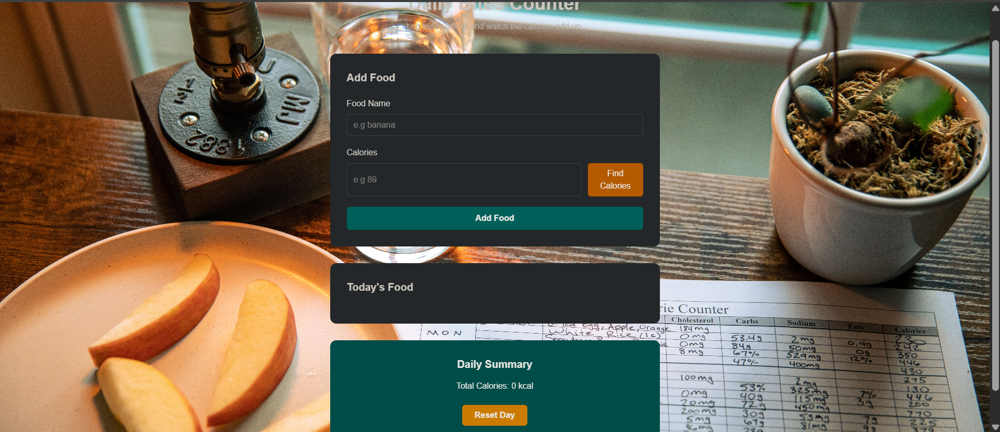

# Daily Bites Counter
***Daily Bites Counter*** is a simple webpage that helps you log what you ate today and see how many calories you have taken.

Type a meal, add the calories, and the page keeps a running total. You can also search a few common foods from a local list.

## Problem statement
People often guess how much they have eaten in a day. Writing meals on paper is easy to lose, and many calorie apps feel too heavy for a class project or a quick daily check.

## Solution
Daily Bites Counter lets you add a food name and calories, shows the list for today, and adds them up. The list stays after refresh. If the food is in the local list, you can look up the calories instead of typing the number.

## Features
### 1. Add a meal
- Form for food name and calories
- Save meal button adds the item to today's list

### 2. Today's list
- Shows each meal and its calories
- Remove button deletes one item
- Empty message when no food has been added yet

### 3. Daily total
- Shows the total calories for the day
- Reset button clears the list for a new day

### 4. Find calories
- Looks up foods from `foods.json`
- Fills the calories box if the name is found
- Asks you to type the number if the food is not in the list

### 5. Save data
- Uses localStorage so meals stay after you refresh the page

### File structure
```
index.html
styles.css
script.js
foods.json
```
### Installation setup
To run this project
```
https://github.com/JohnnyKhayo/dailybites.counter_health.git
```
*right click* and **open live server** or ***go live***

### How the project looks like 



### Collaborate and contribution
For anyone intrested in contributing and collaborating to this project. Please free and follow the steps below.
1. Clone the project
``` 
git clone https://github.com/JohnnyKhayo/dailybites.counter_health.git
```
2. Make a pull request
3. Document the contribution as an issue

#### License
This project was created abd build by @JohnnyKhayo under MIT license. 

